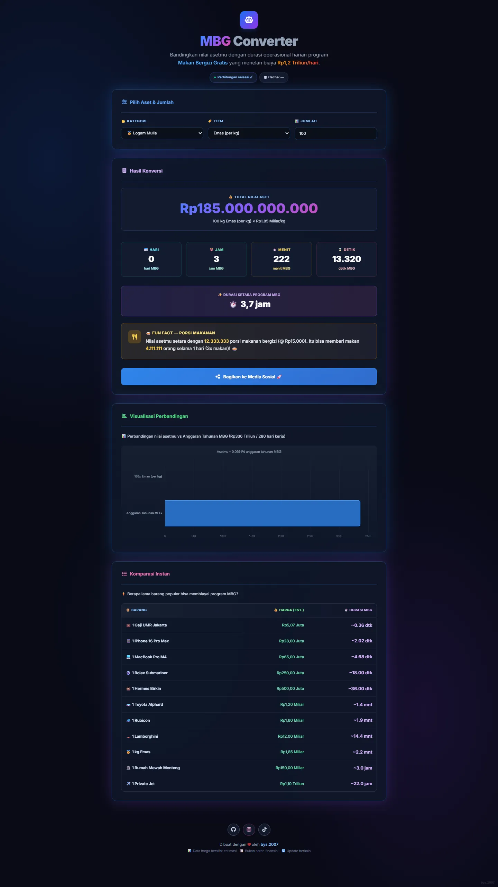

<div align="center">
  

  # ⚖️ MBG Converter

  **Bandingkan nilai aset impianmu dengan operasional harian program Makan Bergizi Gratis (MBG) Indonesia.**

  [](https://bys2007.github.io/MBG-Converter/)
  []()
  []()
  []()

  <p align="center">
    <a href="#-tentang-proyek">Tentang</a> •
    <a href="#-fitur-utama">Fitur</a> •
    <a href="#-teknologi">Teknologi</a> •
    <a href="#-cara-menjalankan">Cara Instalasi</a>
  </p>
</div>

---

## 📖 Tentang Proyek

**MBG Converter** adalah aplikasi Single Page Application (SPA) edukasional yang memberikan perbandingan perspektif antara nilai aset populer (seperti Kripto, Barang Mewah, atau Gaji Pejabat) dengan anggaran super besar dari program **Makan Bergizi Gratis (MBG)** di Indonesia, yang memakan biaya sekitar **Rp 1,2 Triliun per hari**.

Tujuan proyek ini adalah membantu publik memvisualisasikan seberapa masifnya angka 1 Triliun Rupiah dengan cara yang *fun*, interaktif, dan mudah dimengerti.

## ✨ Fitur Utama

- 🔄 **Real-Time Data Integration:** Terintegrasi langsung dengan **CoinGecko API** untuk harga Kripto (BTC, ETH, SOL) dan **ExchangeRate-API** untuk konversi nilai tukar Mata Uang Fiat (USD, EUR, JPY).
- ⚡ **Local Caching System:** Menggunakan `localStorage` dengan waktu kedaluwarsa 10 menit untuk mencegah *rate-limit* dari API dan memberikan pengalaman yang sangat cepat tanpa jeda.
- 🎨 **Premium Aesthetic UI:** Antarmuka responsif dan modern dengan tema *Dark Glassmorphism*, efek *glow*, dan *animated mesh gradient*.
- 📊 **Visualisasi Data Chart.js:** Membandingkan harga total dari aset pilihan Anda langsung secara visual melawan besaran Anggaran Tahunan MBG (Rp 336 Triliun) dalam bentuk bar chart estetik.
- 📱 **Social Share Builder:** *Generate* otomatis kata-kata *fun-fact* (fakta menarik) yang gaul dan puitis lengkap dengan link website!
- ⚡ **Zero Dependencies:** Web ini adalah Vanilla stack tanpa ribet proses instalasi *build tool* atau Node Modules. Dibuat langsung untuk *plug-and-play*.

## 🛠 Teknologi

Proyek ini dibangun menggunakan *stack* esensial modern tanpa framework *heavy-weight*:

- **HTML5** (Semantik struktur)
- **Vanilla JavaScript** (Logika, State, & Fetch API)
- **Tailwind CSS *(via CDN)*** (Styling modern)
- **Chart.js** (Visualisasi data grafis)
- **Font Awesome** (Tipografi Ikonografi)

## 🚀 Cara Menjalankan

Karena proyek ini berjalan penuh di sisi *Client* (*client-side render* murni), cara menjalankannya sangatlah mudah!

**Opsi 1: Menjalankan Langsung**
Cukup *clone* atau *download* repository ini, kemudian klik ganda (buka) file `index.html` langsung pada browser (Chrome/Edge/Firefox/Safari) PC Anda. Selesai!

**Opsi 2: Menggunakan Local Development Server**
Jika Anda menggunakan Visual Studio Code, sangat disarankan menggunakan ekstensi **Live Server** atau ekstensi sejenis untuk mendapatkan fitur auto-reload. 

Atau menggunakan *Serve* dari Node.js (via Terminal):
```bash
npx serve .
```
Aplikasi akan langsung berjalan secara elegan di `http://localhost:3000/`.

---

<div align="center">
  Dibuat dengan ❤️ oleh <a href="https://github.com/bys2007"><b>bys.2007</b></a>
  <br>
  <sub><i>Data harga pada web bersifat estimasi dan bukan saran finansial.</i></sub>
</div>
